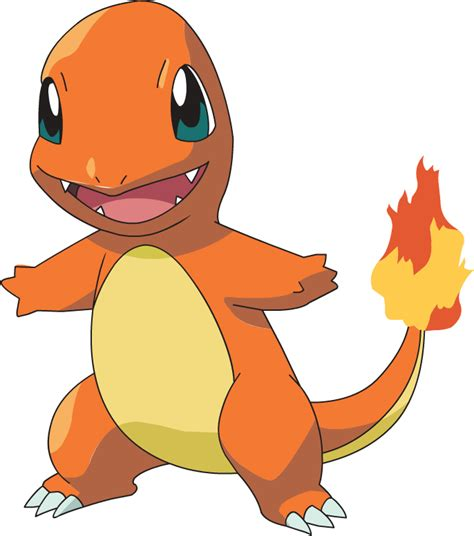

# Which yu-gi-oh card are you?
So one day I was chilling and watching some meme compilations on youtube, when I saw this one:  
  
I've had a good chuckle over this one... and then I spend a month trying to figure out which yu-gi-oh card do I look like.

## How to use:
```
usage: wycay.py [-h] [--include-top] model image_path

See which Yu-Gi-Oh! card you look like.

positional arguments:
  model          name of NN model to use [vgg16/resnet50/mobilenet]
  image_path     path to the input image

options:
  -h, --help     show this help message and exit
  --include-top  include top of the model
```

## How it works:
First, download a local copy off all card images. Since there's a lot of them (over 12 thousand), it takes some time even with a good internet connection, and often around the 1000th request the connection fails, possibly due to too many consecutive requests. The scripts used for getting the cards are in [prodeck_api.py](prodeck_api.py) file.  
  
Then I had to figure out a way to crop the images from the cards. I wanted to do it the smart way, using some computer vision techniques, but I've decided that it's not the most pressing problem and settled on just cutting them 'the dumb way' (aka just using predefined constant values). I might come back to this part and figure out a more elegant way of doing it. The cropping scripts are in [crop.py](crop.py) file.

Finally, I had to implement the image comparison using machine learning. After reading some articles online I came to the conclusion that I'll just import pretrained neural network models and use them as embedders. Since I wasn't sure whether to use the imagenet classes predictions as the embedding, or just use the feature extractor, I used both. Since every card is its own class, there is no point in retraining the net's top. The difference between embedding vectors is calculated as the sum of squared differences. Obviosly only the face images from the cards are used for comparison and not the whole cards with text and a frame.

In the following chapter where I test the performance of the program I use VGG16, ResNet50 and MobileNet. However theses choices are completely arbitrary and not based on any properties or characteristics of these models.

## Results:
Test image:  
  

| Model used    | include_top = True                                                                | include_top = False                                                               |
|---------------|-----------------------------------------------------------------------------------|-----------------------------------------------------------------------------------|
| VGG16         |   |   |
| ResNet50      |   |   |
| MobileNet     |   |   |

Test image:  
  

| Model used    | include_top = True                                                                | include_top = False                                                               |
|---------------|-----------------------------------------------------------------------------------|-----------------------------------------------------------------------------------|
| VGG16         |   |   |
| ResNet50      |   |   |
| MobileNet     |   |    |

## Conclusions:
None of the predictions were even close to being acceptable.

## Credits and resources:
- [The "pot of greed" meme](https://youtu.be/4guF2x-mzBI?t=247). This is where I saw it for the first time, although it's not the meme's origin. I couldn't find the original.
- Card images are downloaded from [ygoprodeck.com](https://db.ygoprodeck.com/api-guide/) using their amazing API.
- Keras applications documentation can be found [here](https://www.tensorflow.org/api_docs/python/tf/keras/applications/).
- [A notebook](https://github.com/cloudxlab/opencv-intro/blob/master/6_edge_detection.ipynb) presenting edge detection in computer vision.
- [A notebook](https://gitlab.com/AmosHung/keras-pretrained-feature-extraction/-/blob/master/KerasPretrained.ipynb) presenting feature extraction using pretrained keras models.