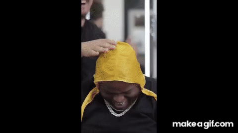

# Which yu-gi-oh card are you?
So one day I was chilling and watching some meme compilations on youtube, when I saw this one:  
  
I've had a good chuckle over this one... and then I spend a week trying to figure out which yu-gi-oh card do I look like.

## How to use:

## How it works:
First, download a local copy off all card images. Since there's a lot of them (over 12 thousand), it takes some time even with a good internet connection, and often around the 1000th request the connection fails, possibly due to too many requests. The scripts used for getting the cards are in [prodeck_api.py](prodeck_api.py) file.  
  
Then I had to figure out a way to crop the images from the cards. I wanted to do it the smart way, using some computer vision techniques, but I've decided that it's not the most pressing problem and settled on just cutting them 'the dumb way' (aka just using predefined constant values). I might come back to this part and figure out a more elegant way of doing it. The cropping scripts are in [crop.py](crop.py) file.

Since every card is its own class, there is no point in retraining the net's top.

## Results charmander:

| Model used    | include_top = True                            | include_top = False                           |
|---------------|-----------------------------------------------|-----------------------------------------------|
| VGG16         |    |    |
| ResNet50      |    |    |
| MobileNet     |    |    |

## Results fresh cut:

| Model used    | include_top = True                            | include_top = False                           |
|---------------|-----------------------------------------------|-----------------------------------------------|
| VGG16         |    |    |
| ResNet50      |    |    |
| MobileNet     |    |    |

## Final thoughts:

## Credits and resources:
- [The "pot of greed" meme](https://youtu.be/4guF2x-mzBI?t=247). This is where I saw it for the first time, although it's not the meme's origin. I couldn't find the original.
- Card images are downloaded from [ygoprodeck.com](https://db.ygoprodeck.com/api-guide/) using their amazing API.
- Keras applications documentation can be found [here](https://www.tensorflow.org/api_docs/python/tf/keras/applications/).
  
- https://github.com/cloudxlab/opencv-intro/blob/master/6_edge_detection.ipynb
- https://gitlab.com/AmosHung/keras-pretrained-feature-extraction/-/blob/master/KerasPretrained.ipynb
- https://www.tensorflow.org/api_docs/python/tf/keras/applications/
- https://towardsdatascience.com/finding-similar-images-using-deep-learning-and-locality-sensitive-hashing-9528afee02f5